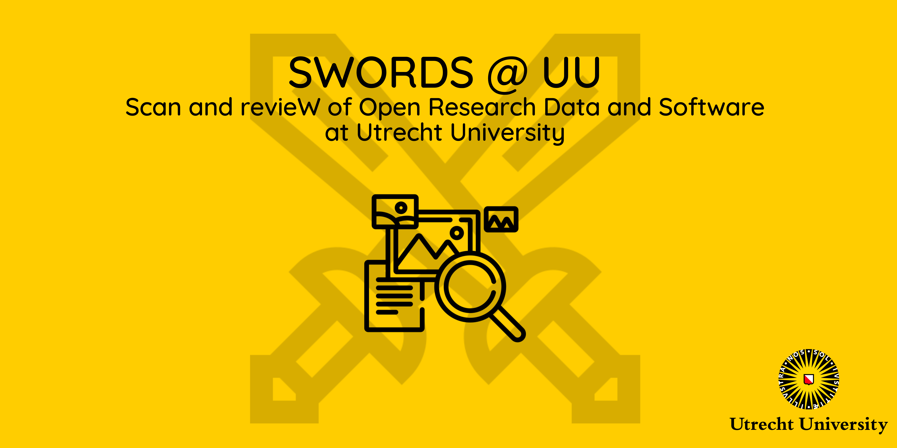
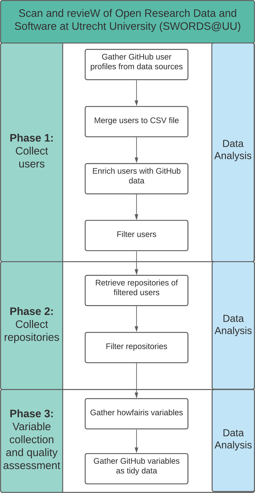

# SWORDS@UU 



## About

This repository is the implementation for the Scan and revieW of Open Research Data and Software at Utrecht University (SWORDS@UU). 

- This project is a collaboration of the Research IT and ICS Department, supported by the Open Science Platform. ​In order to promote open science, Utrecht University has launched the Open Science Programme. To add focus to specific topics, there are four tracks within the Programme: Open access, FAIR data and software, Public engagement, Recognition and rewards. Within the track of FAIR data and software, a research project regarding the Scan and revieW of Open Research Data and Software at Utrecht University (SWORDS@UU) has been conducted.  

- Its goal is to analyze the FAIRness of GitHub repositories of Utrecht University researchers and see how they develop and manage software. While the analysis and data collection is done for Utrecht University researchers only, the purpose of this research is to serve as a template for other researchers to scan and review repositories for their university as well.

The project is split into 3 phases that correspond to the folder structure. The following hyperlinks lead to the detailed readme of each phase.

1. [User collection](collect_users/README.md)
2. [Repository collection](collect_repositories/README.md)
3. [Variable collection](collect_variables/README.md)

Each phase consists of several Python scripts and file outputs, mainly in .csv format. There is also a corresponding interactive data analysis jupyter notebook file in each phase. You can find the whole pipeline as a diagram under [Pipeline](#flowchart).

For more information about the phases, please look into the corresponding subfolders for further information on installation and usage. Note that every .csv output has a datestamp column named **date**.

## Pipeline

<p align="center">
  
</p>

## Dashboard

A Kibana dashboard has been implemented to work with the data in addition to the Jupyter notebooks. The exported dashboard can be found in the subfolder kibana_dashboard/[data-dashboard.ndjson](kibana_dashboard/data-dashboard.ndjson). In order to run the dashboard on your local machine, first install ElasticSearch and Kibana as stated [on their website](https://www.elastic.co/start). To import the data and dashboard, follow [their documentation](https://www.elastic.co/guide/en/kibana/current/saved-objects-api-import.html). Alternatively, there is an easier method of importing in version 7.16:

1. Open the *hamburger menu*
2. Scroll down to Management --> click *Stack management*
3. Under Kibana, click on *Saved Objects*
4. Click on the *import* button and select the file [data-dashboard.ndjson](kibana_dashboard/data-dashboard.ndjson).

After following their documentation or these steps, the dashboard with the related data in the indices *repos* and *users* should be loaded.

## Contact

For technical questions, you contact either [Keven Quach](https://github.com/kequach) or [Jonathan de Bruin](https://github.com/J535D165) or open an issue on GitHub.

## Contributors

This project was implemented by de Bruin, J., Quach, K., Slewe, C., & Lamprecht, A. (2021).

### Citation

Use this citation for citing the SWORDS implementation of Utrecht University.
```
@software{de_Bruin_Scan_and_revieW_2021,
author = {de Bruin, Jonathan and Quach, Keven and Slewe, Christopher and Lamprecht, Anna-Lena},
month = {9},
title = {{Scan and revieW of Open Research Data and Software at Utrecht University}},
url = {https://github.com/UtrechtUniversity/SWORDS-UU},
version = {1.0.0},
year = {2021}
}
```

Use this citation for citing the SWORDS template.
```
@software{de_Bruin_Scan_and_revieW_2021,
author = {de Bruin, Jonathan and Quach, Keven and Slewe, Christopher and Lamprecht, Anna-Lena},
month = {9},
title = {{Template of Scan and revieW of Open Research Data and Software}},
url = {https://github.com/UtrechtUniversity/SWORDS-template},
version = {1.0.0},
year = {2021}
}
```

## Attribution

<div>Icons made by <a href="https://www.freepik.com" title="Freepik">Freepik</a> from <a href="https://www.flaticon.com/" title="Flaticon">www.flaticon.com</a></div>
