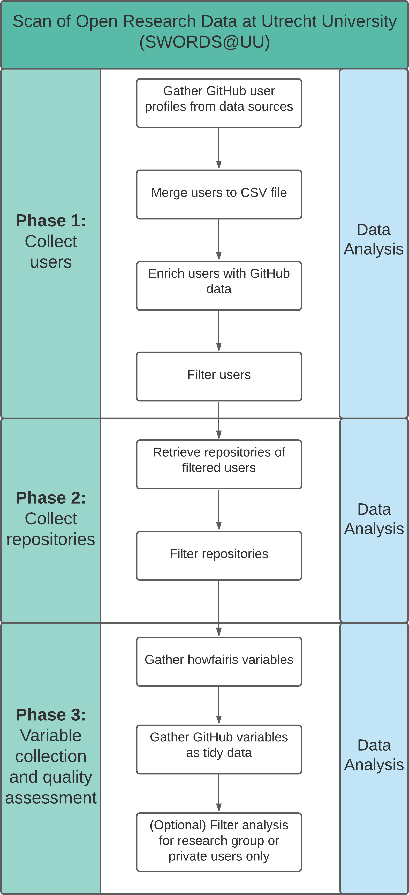

# SWORDS@UU <!-- omit in toc -->

- [Pipeline](#pipeline)
- [Phase 2: Variable collection](#phase-2-variable-collection)
  - [Installation](#installation)
  - [Flowchart](#flowchart)

This repository is the implementation for the Scan of Open Research Data at Utrecht University (SWORDS@UU). The project is split into 3 phases that correspond to the folder structure. The following hyperlinks lead to the detailed readme of each phase.

1. [User collection](collect_users/README.md)
2. [Repository collection](collect_repositories/README.md)
3. [Variable collection](collect_variables/README.md)

Each phase consists of several Python scripts and file outputs, mainly in .csv format. There is also a corresponding interactive data analysis jupyter notebook file in each phase. You can find the whole pipeline as a diagram under [Pipeline](#flowchart).

For more information about the phases, please look into the corresponding subfolders for further information on installation and usage.

## Pipeline

