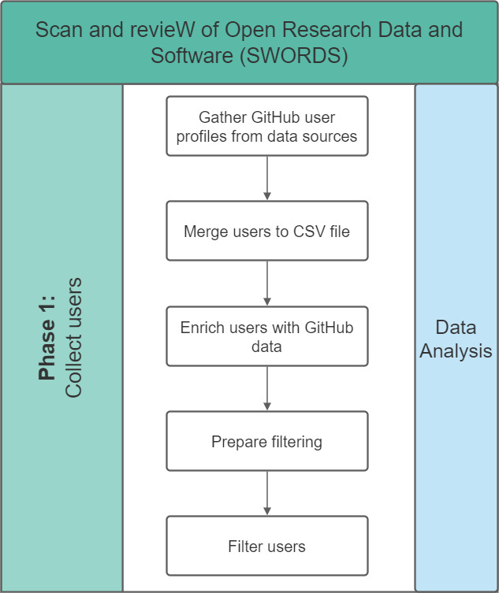
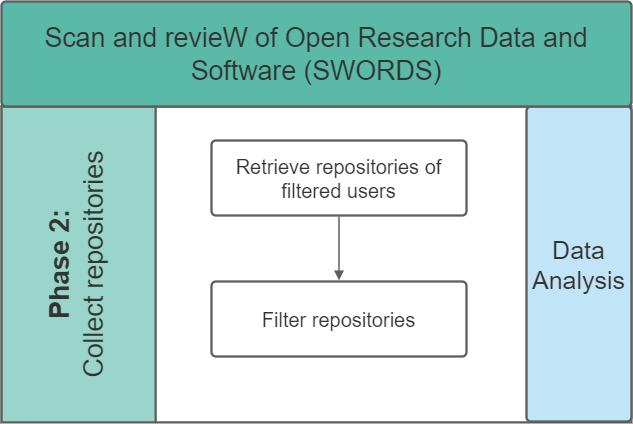

# SWORDS@UU

- [SWORDS@UU](#swordsuu)
  - [Phase 1: User and repository collection](#phase-1-user-and-repository-collection)
    - [Installation](#installation)
    - [Flowchart](#flowchart)
    - [Usage](#usage)
  - [Phase 2: Variable collection](#phase-2-variable-collection)
    - [Installation](#installation-1)
    - [Flowchart](#flowchart-1)
    - [Usage](#usage-1)
  - [Phase 3: Analysis](#phase-3-analysis)

## Phase 1: User and repository collection
The data was retrieved on the following date: 30.04.2021 (DD/MM/YYYY)

### Installation

Install the necessary requirements for each retrieval method through the requirements.txt in the corresponding subfolders in **repository_collection** with the following command. This assumes that the command line is currently in the specified subfolder:

```bash
pip install -r requirements.txt
```

### Flowchart



### Usage

1. Execute the scripts in the subfolders **github_search**, **pure** and **university_profile_pages** in any order. This assumes that the current location is the root folder of the project:
    ```bash
    python3 repository_collection/github_search/github_search.py
    python3 repository_collection/pure/pure.py
    python3 repository_collection/university_profile_pages/uu_api_crawler.py
    ```
    Note that **papers_with_code** results were collected manually due to only 4 papers being available.

    The result will be located in each subfolder within a results subfolder where .csv files are generated. 

2. Then, go through the **merge_github_user_profiles.ipynb** Jupyter notebook to merge all results.
    Note that you should create a .env file in the root project folder and add the following line:
    ```GITHUB_TOKEN = "YOUR_PERSONAL_GITHUB_TOKEN" ```
    See here on how to create a Github token: https://docs.github.com/en/github/authenticating-to-github/creating-a-personal-access-token 
    Since the Github API is limiting the number of unauthorized requests quite a lot, this is necessary to decrease the runtime. The result will be the file **unique_users_annotated.xlsx** with all unique users.
3. Execute the script found in the **get_repositories** subfolder:
    ```bash
    python3 repository_collection/get_repositories/repositories.py
    ```
    The result will be a .csv file in the folder repository_collection with all repositories of the unique users.

Note that it is possible to re-run step 1 at a later time to retrieve more users. The Jupyter notebook **merge_github_user_profiles.ipynb** is able to update the **unique_users_annotated.xlsx** with new users and can also update the information from all users. See the notebook for details.

## Phase 2: Variable collection

### Installation

Install the necessary requirements for each retrieval method through the requirements.txt in the corresponding subfolders in **variable_collection** with the following command. This assumes that the command line is currently in the specified subfolder:

```bash
pip install -r requirements.txt
```

### Flowchart



### Usage

Please note: Every collected dataset has the date of collection in the file name. Therefore, it is necessary to adjust the filenames in each script.

1. Execute the script **filter_repos.py** in the folder **variable_collection**:
    ```bash
    python3 variable_collection/filter_repos.py
    ```
    The script will generate a .csv file within the folder **variable_collection/output** named **repositories_howfairis_YYYY-MM-DD.csv**. 

2. Execute the scripts in the subfolders **howfairis** and **github_api** in any order. This assumes that the current location is the root folder of the project:
    ```bash
    python3 variable_collection/howfairis/howfairis_variables.py
    python3 variable_collection/github_api/extract_topics.py
    python3 variable_collection/github_api/get_contributors.py
    python3 variable_collection/github_api/get_languages.py
    ```
    The scripts will generate .csv files within the folder **variable_collection/output**. 
    
## Phase 3: Analysis

We provided examples of analysis in two jupyter notebooks. The requirements have been installed in the previous phase. 

1. open the notebook **repository_collection/analysis_of_data_sources.ipynb** using jupyter notebook

This notebook explores the data sources that were used to collect the repositories. 

2. open the notebook **repository_collection/repo_analysis.ipynb** using jupyter notebook

This notebook analysis the information in the repositories. The notebook contains analysis of licenses, programming languages, howfairis scores and other variables present in github repositories.  
