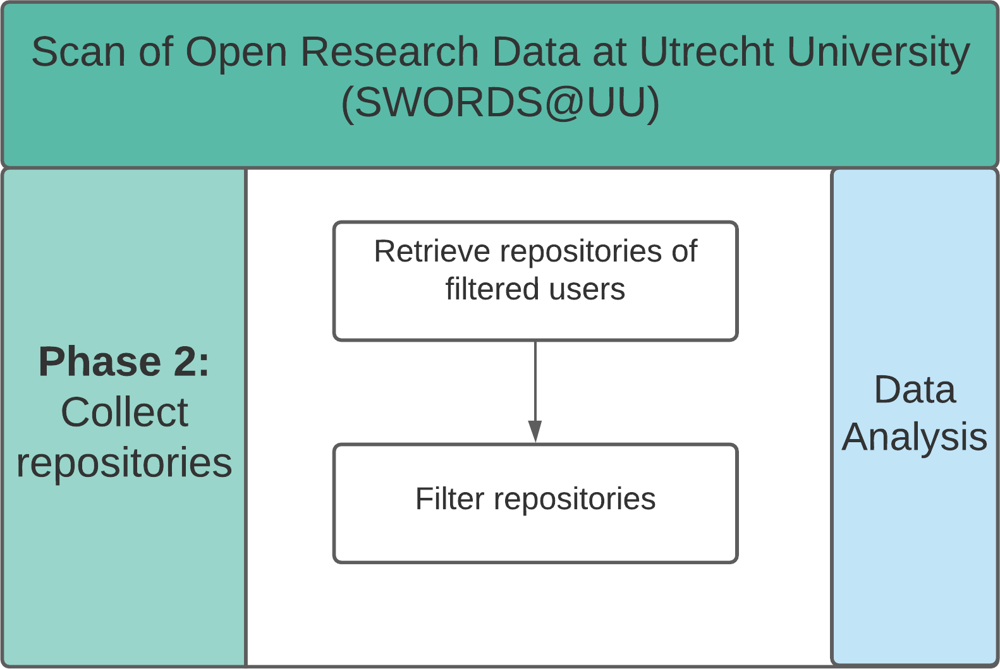

# Repository collection <!-- omit in toc -->

- [Installation](#installation)
- [Usage](#usage)
  - [Retrieve repositories of filtered users](#retrieve-repositories-of-filtered-users)
  - [Filter repositories](#filter-repositories)
  - [Data analysis](#data-analysis)
- [License](#license)
- [Contact](#contact)



This submodule of the SWORDS project is used to collect GitHub repositories from users that were collected in the previous phase. 

## Installation 

The code in this submodule requires Python 3.7+. To install the code dependencies, install the packages in the requirements file. 

```console
pip install -r requirements.txt
```

## Usage

### Retrieve repositories of filtered users

In this step, repositories of enriched users are retrieved. To do this, execute the file **repositories.py**. Note: The column with githuber user ids needs to have the name **user_id**.
There are 2 arguments that can be passed.

- --users: The path to the file with enriched users. Default value: ../collect_users/results/users_enriched.xlsx
- --output: The file name of the repositories that are retrieved. Default value: results/repositories.csv

Navigate to this folder and execute the script. Adjust parameters as needed. Example:

```console
python scripts/repositories.py --users ../collect_users/results/unique_users_annotated.xlsx --output results/repositories.csv
python scripts/repositories.py --users ../collect_users/results/users_enriched.csv
```

### Filter repositories

In this step, non-relevant repositories are filtered. To do this, execute the file **filter_repos.py**.
There are 2 arguments that can be passed. Bold arguments are required:

- --input: The file name of the retrieved repositories. Default value: results/repositories.csv
- --output: The file name of the filtered repositories. Default value: results/repositories_filtered.csv

Navigate to this folder and execute the script. Adjust parameters as needed. Example:

```console
python scripts/filter_repos.py --input results/repositories.csv 
python scripts/filter_repos.py
```

Currently, the script only filters out *github.io* repositories, as these are usually no research repositories. Additional filtering can be done manually.

### Data analysis

Interactive data analysis can be found in the [Jupyter Notebook analyze_repositories.ipynb](analyze_repositories.ipynb). It is possible to optionally filter the analysis for research groups or private users only. This is elaborated in the Jupyter notebook.

This notebook analyzes the information of the retrieved repositories. The notebook contains analysis of open science mentions, stargazers, watchers, issues, forks, branches, homepages and commits.

## License 

See [/LICENSE](../LICENSE).

## Contact 

See [here](../README.md#contact).