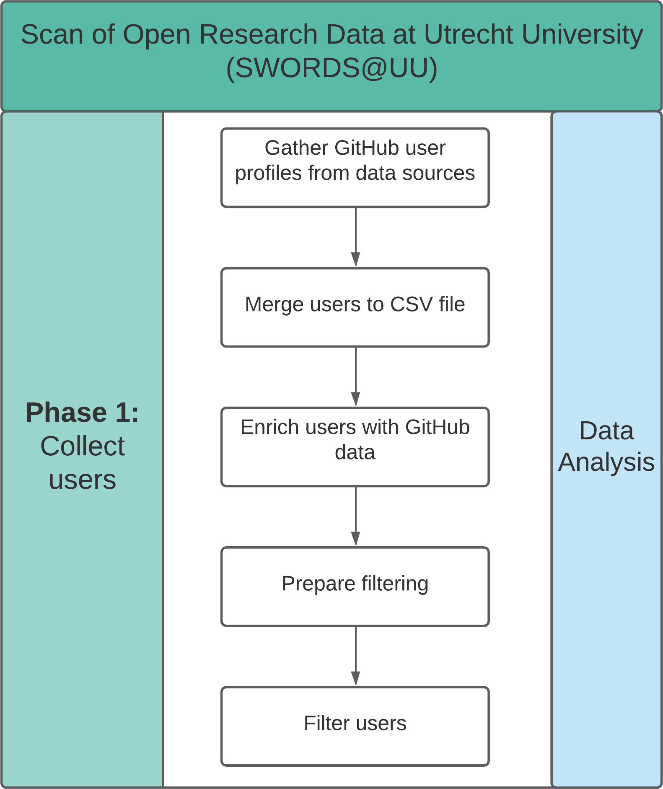

# User collection



This submodule of the SWORDS project is used to collect user profiles from
GitHub and GitLab that match the given criteria. 

Currently, the following collection methods are available: 

- PapersWithCode
- GitHub Search
- Pure
- UU employee pages

## Installation 

The code in this submodule requires Python 3.7+. To install the code dependencies, install the packages in the requirements file. 

```console
pip install -r github_search/requirements.txt
pip install -r papers_with_code/requirements.txt
pip install -r pure/requirements.txt
pip install -r university_profile_pages/requirements.txt
```

## Usage

See each individual user collection method for usage instructions. Each method
stores the collected user profiles in the `results` folder. 

Because there are multiple user collection methods, users can be found with
multiple methods. Therefore, the collected data is deduplicated after
collection. 

Users from each collection method need to be merged after each method was executed. To do this, execute the file **merge_users.py**.
There are 2 arguments that can be passed. Bold arguments are required:

- --**files**: The query for merging the .csv files. To merge all .csv files in each results folder, use the following query: '*/results/*.csv'
- --output: The file name of the merged output. Default value: users_merged.csv

Navigate to this folder and execute the script. Adjust parameters as needed. Example:

```console
python merge_users.py --files '*/results/*.csv' --output 'users_merged.csv'
```

The structure of the exported data is as follows:

```
github_user_id,source
```

Where source indicates from which method the user id was retrieved.

Next, the data is enriched with GitHub information. Execute the file **enrich_users.py**.
 Note: This script can also be used to update an existing file. It can also be specified whether the update should only include new entries (e.g. when there are more results available) or if everything should be updated.
There are 4 arguments that can be passed. Bold arguments are required:

- --**input**: The file name of the input. Default: users_merged.csv
- --update: Update everything including existing users or only add new users. Default is False.
- --fileupdate: If you want to update an existing file, provide a file name in this argument. Example: 'unique_users_annotated.xlsx'
- --output: The file name of the enriched output. Default: users_enriched.csv

Navigate to this folder and execute the script. Adjust parameters as needed. Examples:

```console
python enrich_users.py --input users_merged.csv
python enrich_users.py --input users_merged.csv --update False --fileupdate "unique_users_annotated.xlsx"
python enrich_users.py --input users_merged.csv --update True --fileupdate "unique_users_annotated.xlsx" --output "unique_users_annotated.xlsx"
```

## License 

See [/LICENSE](LICENSE).

## Contact 

See https://github.com/UtrechtUniversity/SWORDS-UU.