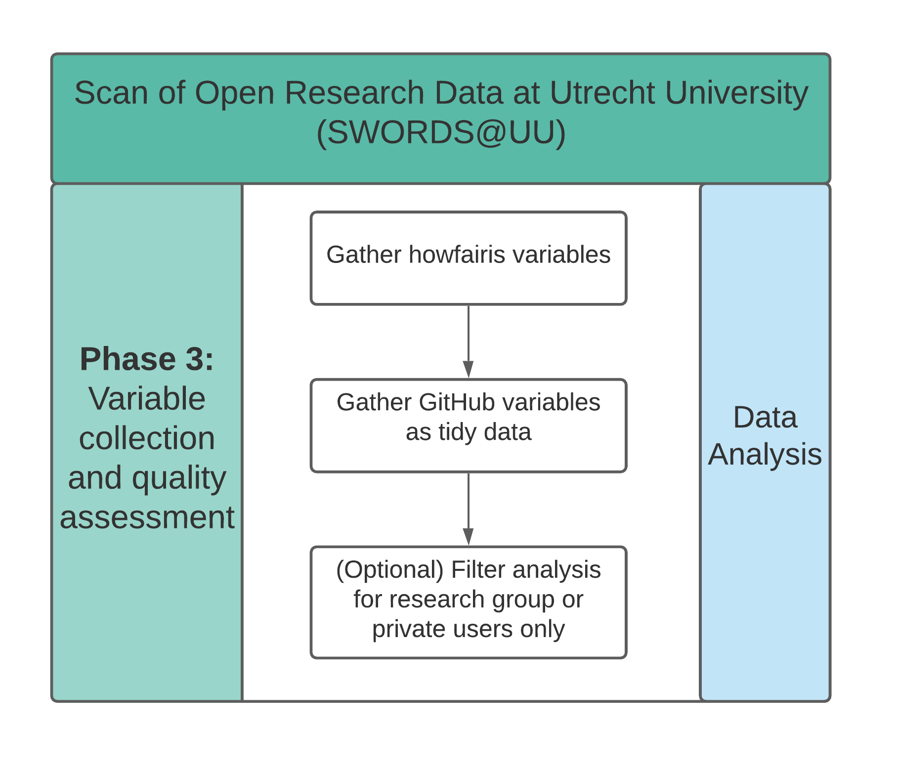

# Variable collection



This submodule of the SWORDS project is used to collect GitHub repositories from users that were collected in the previous phase.

## Installation

The code in this submodule requires Python 3.7+. To install the code dependencies for the data analysis, install the packages in the requirements file. Each variable collection has its own requirements.txt file to allow only necessary dependencies to be installed.

```console
pip install -r scripts/github_api/requirements.txt
pip install -r scripts/howfairis_api/requirements.txt
pip install -r requirements.txt
```

## Usage

### Gather all variables as JSON data

This step can be executed in addition to [Gather howfairis variables](#gather-howfairis-variables) and [Gather GitHub variables as tidy data](#gather-github-variables-as-tidy-data). The corresponding script will fetch the same variables in JSON data format such that it can be inserted into Elasticsearch and Kibana for visualization purposes. To do this, execute the file **all_variables.py**.

There are 2 arguments that can be passed.

- --input: The file name of the repositories. Default value: ../collect_repositories/results/repositories_filtered.csv
- --output: The file name of the output. Default value: results/all_variables.json

Navigate to this folder and execute the script. Adjust parameters as needed. Example:

```console
python scripts/all_variables.py
```

### Gather howfairis variables

In this step, howfairis variables are retrieved. To do this, execute the file **howfairis_variables.py**. Note: The output concatenates the howfairis variables to the whole repository data. By doing so, it is possible to reuse this file to gather GitHub variables based on this file.
There are 2 arguments that can be passed.

- `--input`: The file name of the repositories. Default value: `../collect_repositories/results/repositories_filtered.csv`
- `--output`: The file name of the output. Default value: `results/repositories_howfairis.csv`

Navigate to this folder and execute the script. Adjust parameters as needed. Example:

```console
python scripts/howfairis_api/howfairis_variables.py
python scripts/howfairis_api/howfairis_variables.py --input ../collect_repositories/results/repositories_filtered_2021-11-04.csv
python scripts/howfairis_api/howfairis_variables.py --input ../collect_repositories/results/repositories_filtered_2021-11-04.csv --output results/repositories_howfairis_duplicate
```

### Gather GitHub variables as tidy data

In this step, additional variables from repositories are retrieved. These include information about contributors, used languages, jupyter notebook file paths and topics in tidy data format. To do this, execute the file **github.py**.
There are 10 arguments that can be passed. For each of the 4 information types you can set a flag if you want to retrieve this information, as well as the file output path which is optional. In addition, the jupyter notebooks require an additional argument to specify an input file for the languages (output file of languages) in case languages is not also retrieved. See examples.

- `--input`: The file name of the repositories data. This can also be the output from the previous howfairis step. Default: `results/repositories_howfairis.csv`
- `--contributors`: Set this flag if contributors should be retrieved
- `--contributors_output`: Optional. Path for contributors output. Default: `results/contributors`
- `--jupyter`: Set this flag if jupyter notebooks should be retrieved
- `--input_languages`: Optional. If languages are not retrieved but jupyter notebooks should be, there needs to be an input file with the languages.
- `--jupyter_output`: Optional. Path for jupyter notebooks output. Default: `results/jupyter_notebooks`
- `--languages`: Set this flag if languages should be retrieved
- `--languages_output`: Optional. Path for languages output. Default: `results/languages`
- `--topics`: Set this flag if topics should be retrieved
- `--topics_output`: Optional. Path for topics output. Default: `results/topics`

Navigate to this folder and execute the script. Adjust parameters as needed. Example:

```console
python scripts/github_api/github.py --jupyter --contributors --languages --topics
python scripts/github_api/github.py --input ../collect_repositories/results/repositories_filtered.csv --contributors --contributors_output results/contributors.csv
python scripts/github_api/github.py --input output/repositories_howfairis.csv --contributors --languages --jupyter --topics
python scripts/github_api/github.py --input output/repositories_howfairis.csv --jupyter --input_languages results/languages.csv
```

### Download statistics

Installation statistics are collected from the PyPi and RStudio CRAN mirror.

```
python scripts/download_stats.py
```

- `--input`: The file name of the input dataset with READMES. Default value: `../collect_variables/results/all_variables.json`
- `--output`: The file name of the output. Default value: `results/download_stats.csv`

### Data analysis

Interactive data analysis can be found in the [Jupyter Notebook analyze_metrics.ipynb](analyze_metrics.ipynb). As mentioned in the phase diagram, it is possible to optionally filter the analysis for research groups or private users only. This is elaborated in the Jupyter notebook.

This notebook analyzes the information of the retrieved variables. The notebook contains analysis of licenses, programming languages, howfairis scores and other variables present in github repositories.

## License

See [/LICENSE](../LICENSE).

## Contact

See [here](../README.md#contact).