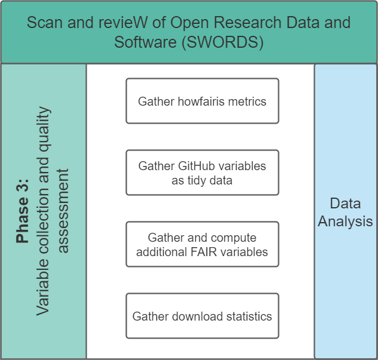

# Variable collection



This submodule of the SWORDS project is used to collect GitHub repositories from users that were collected in the previous phase.

## Installation

The code in this submodule requires Python 3.7+. To install the code dependencies for the data analysis, install the packages in the requirements file. Each variable collection has its own requirements.txt file to allow only necessary dependencies to be installed.

```console
pip install -r scripts/github_api/requirements.txt
pip install -r scripts/howfairis_api/requirements.txt
pip install -r requirements.txt
```

## Usage

### Gather all variables as JSON data

This step can be executed in addition to [Gather howfairis variables](#gather-howfairis-variables) and [Gather GitHub variables as tidy data](#gather-github-variables-as-tidy-data). The corresponding script will fetch the same variables in JSON data format such that it can be inserted into Elasticsearch and Kibana for visualization purposes. To do this, execute the file **all_variables.py**.

There are 2 arguments that can be passed.

- --input: The file name of the repositories. Default value: ../collect_repositories/results/repositories_filtered.csv
- --output: The file name of the output. Default value: results/all_variables.json

Navigate to this folder and execute the script. Adjust parameters as needed. Example:

```console
python scripts/all_variables.py
```

### Gather howfairis variables

In this step, howfairis variables are retrieved. To do this, execute the file **howfairis_variables.py**. There are 2 arguments that can be passed.

- `--input`: The file name of the repositories. Default value: `../collect_repositories/results/repositories_filtered.csv`
- `--output`: The file name of the output. Default value: `results/howfairis.csv`

Navigate to this folder and execute the script. Adjust parameters as needed. Example:

```console
python scripts/howfairis_api/howfairis_variables.py
python scripts/howfairis_api/howfairis_variables.py --input ../collect_repositories/results/repositories_filtered_2021-11-04.csv
python scripts/howfairis_api/howfairis_variables.py --input ../collect_repositories/results/repositories_filtered_2021-11-04.csv --output results/howfairis_duplicate
```

### Gather GitHub variables as tidy data

In this step, additional variables from repositories are retrieved. These include information about contributors, used languages, file paths, readme content and topics in tidy data format. To do this, execute the file **github.py**.
There are several arguments that can be passed. For each of the information types you can set a flag if you want to retrieve this information, as well as the file output path which is optional.
For file locations, specify a list of comma separated strings for file or folder names that should be searched. Note that the names work as a substring so you can also match any `.ipynb` file for example. See examples.

Note: Some variables were derived based on existing literature. They have been referenced accordingly.

- `--input`: The file name of the repositories data. This can also be the output from the previous howfairis step. Default: `../collect_repositories/results/repositories_filtered.csv`
- `--contributors`: Set this flag if contributors should be retrieved
- `--contributors_output`: Optional. Path for contributors output. Default: `results/contributors`
- `--languages`: Set this flag if languages should be retrieved
- `--languages_output`: Optional. Path for languages output. Default: `results/languages`
- `--topics`: Set this flag if topics should be retrieved
- `--topics_output`: Optional. Path for topics output. Default: `results/topics`
- `--readmes`: Set this flag if readmes should be retrieved
- `--readmes_output`: Optional. Path for readmes output. Default: `results/readmes`
- `--files`: A comma separated string of file names that should be searched. Looks for exact matches. This can also include folder names. Can be used to see if there is a code of conduct or a contributing file for example.
- `--files_output`: Optional. Path for files output. Default: `results/files`
- `--tests`: Set this flag if test folder locations should be retrieved. This only retrieves the first result that is matched during recursive search. One matching result means that a test folder exists.
- `--tests_output`: Optional. Path for test folder output. Default: `results/test_paths`
- `--commits`: Set this flag if commit-related variables should be retrieved. These include the following variables:
  - correct version control usage (was everything committed within a day?) [1]
  - life span of the repository measured as days between first and last commit [1,2]
  - whether the repository is still active (was there a commit within the last 365 days?) [2]
  - GitHub username of the first person who committed
  - date of first commit
- `--commits_output`: Optional. Path for commit variables output. Default: `results/commits`
- `--versions`: Set this flag if version identifiability should be retrieved [3]. This checks only GitHub tags. Tags need to be in the format of `X.X` or `X.X.X`.
- `--versions_output`: Optional. Path for commit variables output. Default: `results/versions`

Navigate to this folder and execute the script. Adjust parameters as needed. Example:

```console
python scripts/github_api/github.py --contributors --languages --topics --readmes --files "CONTRIBUTING,code_of_conduct" --tests --commits --versions
python scripts/github_api/github.py --input ../collect_repositories/results/repositories_filtered.csv --contributors --contributors_output results/contributors.csv
python scripts/github_api/github.py --input results/repositories_labeled.xlsx --contributors --languages --topics
python scripts/github_api/github.py --input results/repositories_labeled.xlsx --input_languages results/languages.csv
python scripts/github_api/github.py --readmes
python scripts/github_api/github.py --files "CONTRIBUTING,code_of_conduct"
python scripts/github_api/github.py --files "CONTRIBUTING,code_of_conduct" --tests
python scripts/github_api/github.py --tests
python scripts/github_api/github.py --commits
```

#### Computing variables based on retrieved GitHub data

There is an additional script to parse the retrieved GitHub data named **parse_github_data.py**. This includes the README.csv and files.csv to compute for the following variables:

- Existence of installation instructions. Done by parsing the README with regex to see if there are mentions of `install / docker`
- Existence of usage examples. Done by parsing the README with regex for mentions of `usage / getting started / quick start / example / tutorial`
- Existence of contribution guidelines. Done by parsing the README with regex for mentions of `contribut`

There are 2 arguments that can be passed.

- `--input`: The file name of the repositories. Default value: `/results/readmes.csv`
- `--output`: The file name of the output. Default value: `results/readme_variables.csv`

Navigate to this folder and execute the script. Adjust parameters as needed. Example:

```console
python scripts/parse_readme/parse_readme.py --input results/readmes.csv
```

### Download statistics

Installation statistics are collected from the registries PyPi, npm and RStudio CRAN mirror. Assumes JSON format as input.

```console
python scripts/download_stats.py
```

- `--input`: The file name of the input dataset with READMES. Default value: `../collect_variables/results/all_variables.json`
- `--output`: The file name of the output. Default value: `results/download_stats.csv`

### Data analysis

Interactive data analysis can be found in the [Jupyter Notebook analyze_metrics.ipynb](analyze_metrics.ipynb). As mentioned in the phase diagram, it is possible to optionally filter the analysis for research groups or private users only. This is elaborated in the Jupyter notebook.

This notebook analyzes the information of the retrieved variables. The notebook contains analysis of licenses, programming languages, howfairis scores and other variables present in github repositories.

## License

See [/LICENSE](../LICENSE).

## Contact

See [here](../README.md#contact).

## References

[1] Russell PH, Johnson RL, Ananthan S, Harnke B, Carlson NE (2018) A large-scale analysis of bioinformatics code on GitHub. PLOS ONE 13(10): e0205898. https://doi.org/10.1371/journal.pone.0205898

[2] W. Hasselbring, L. Carr, S. Hettrick, H. Packer and T. Tiropanis, "Open Source Research Software," in Computer, vol. 53, no. 8, pp. 84-88, Aug. 2020, doi: 10.1109/MC.2020.2998235.

[3] Eva Martín del Pico, Josep Lluís Gelpí, and Salvador Capella-Gutiérrez. FAIRsoft - A practical implementation of FAIR principles for research software. Technical report, bioRxiv, May 2022. URL https://www.biorxiv.org/content/10.1101/2022.05.04.490563v1.
